# CGRA 2020/2021

## Group T05G01

### Miguel Norberto Costa Freitas - up201906159@fe.up.pt

### Diogo Miguel Antunes Chaves Pereira - upXXXXXX@fe.up.pt

## Screenshots

### 1 - MyFish

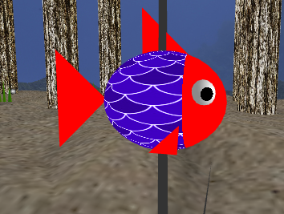

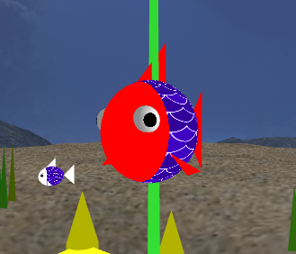

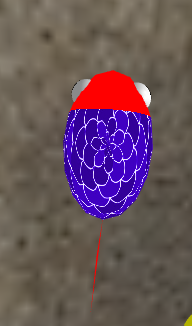

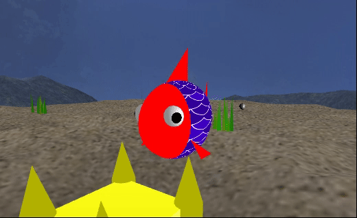

### 2.1 - Sea Floor

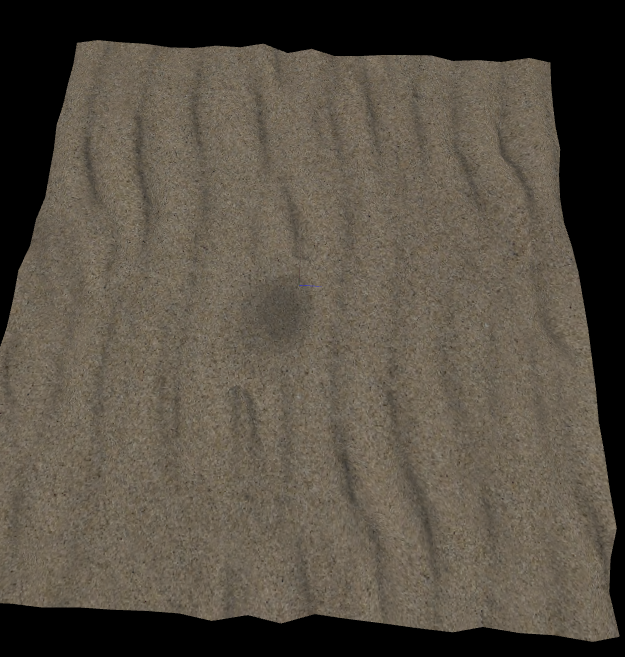

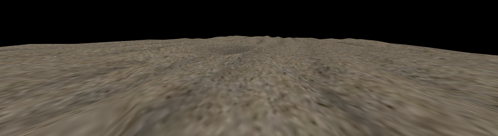

### 2.2 - MyNest

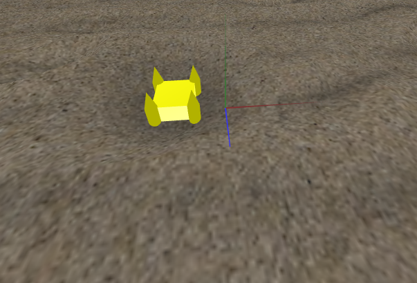

### 3 - MyWaterSurface

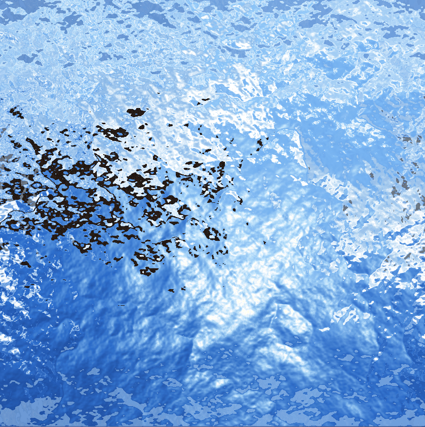

### 4 - MyRockSet

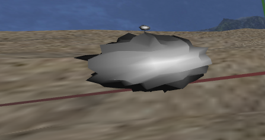

### 5- MyPillar

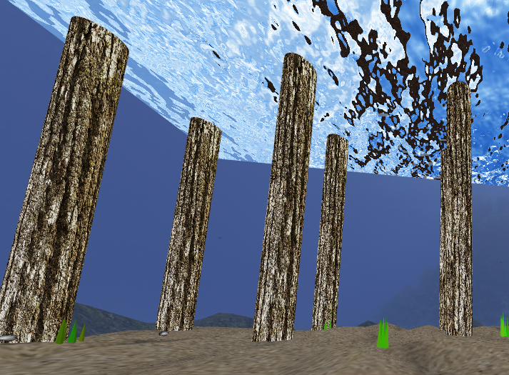

### 6- MyRockSet, MyAlgaeSet, MyPillar, MyNest, MyCubeMap and MyWaterSurface

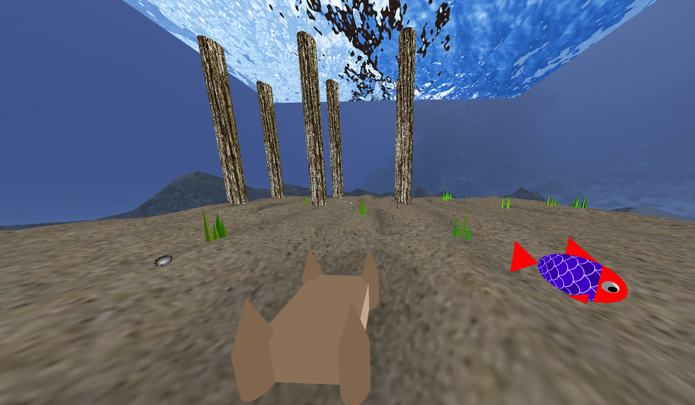

### 6.1 - MyUnderWaterCubeMap

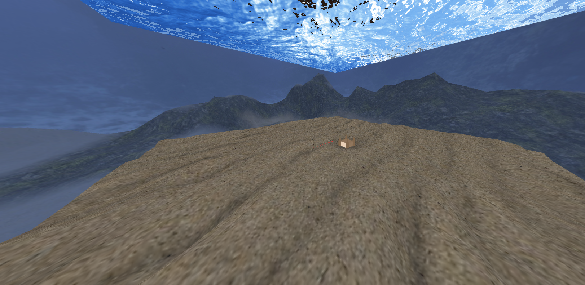

### MyMovingFish

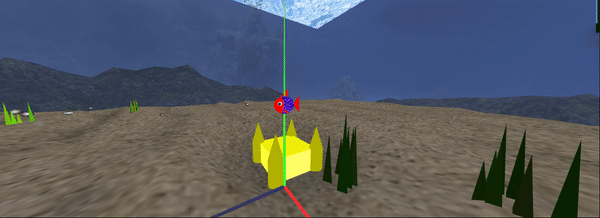

### 7 - Rock PickUp

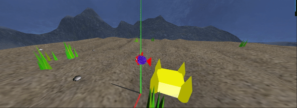

### 8 - Additional Functionality

In this project we implemented points 7.1 - Algas , 7.3 - Colocação de pedras no alvo and 7.5 - MyAnimatedFish

### 8.1 - MyAlgaeSet randomized

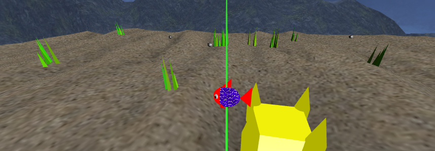

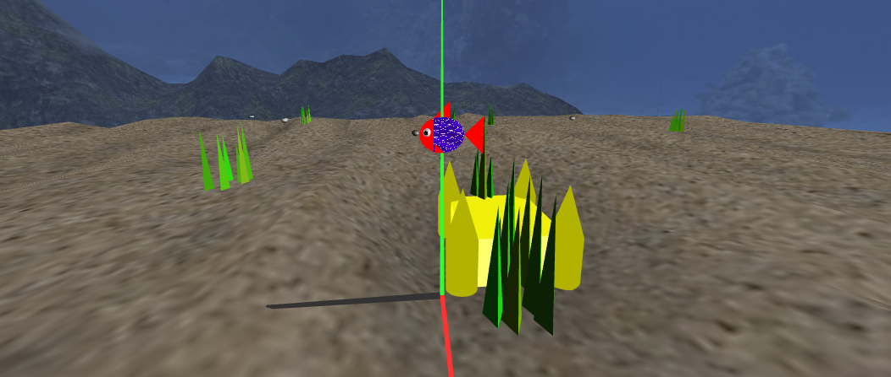

### 8.2 - Randomized Placement of Rocks in the nest

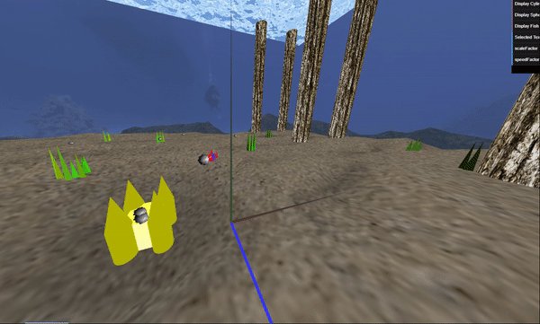

### 8.3 - MyAnimatedFishes

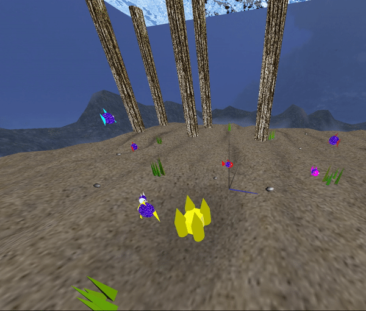

### 5.1 - Final general aspect of the scene

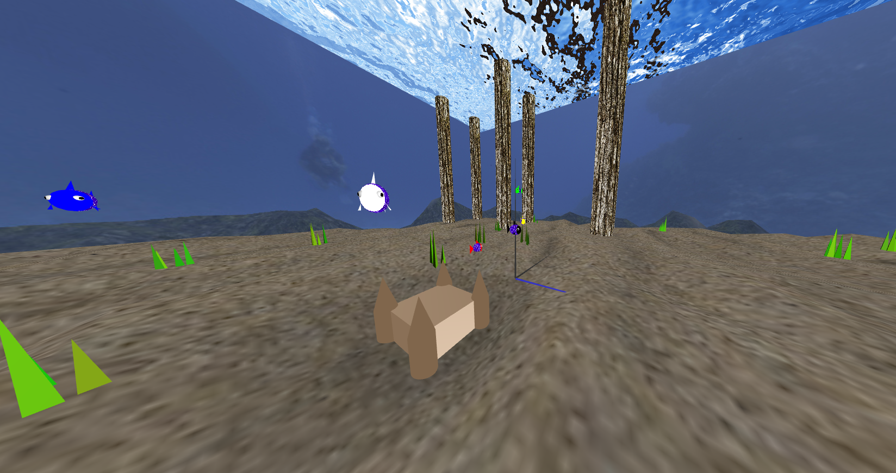

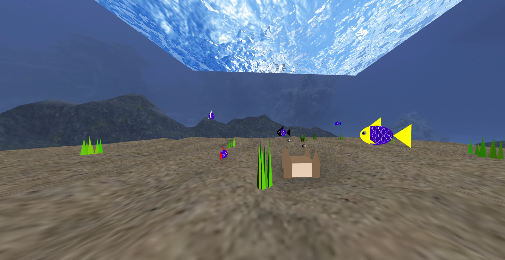

### Copyright Section

### Fish Textures

### Pillar Textures

https://pixabay.com/pt/photos/textura-casca-%C3%A1rvore-tronco-3439570/ - All rights reserved.
